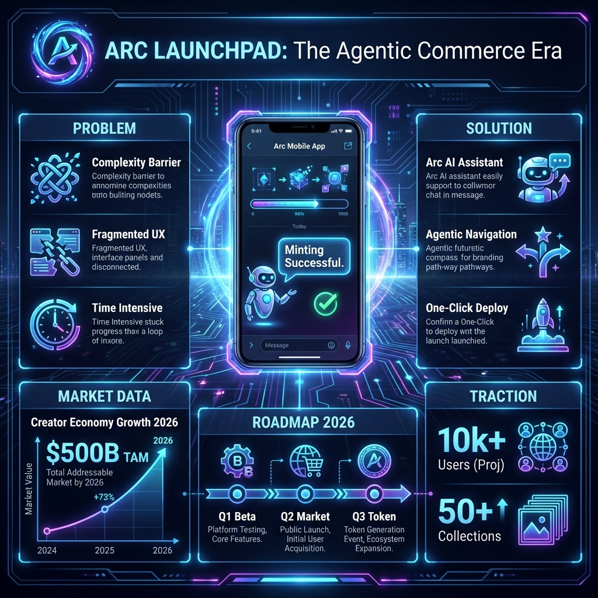

# Arc Launchpad - Pitch Deck

**Slogan:** "Yapay Zeka Asistanınızla Web3'ü Keşfedin"

---

## Slide 1: Giriş (Introduction)

**Başlık:** Arc Launchpad
**Alt Başlık:** **Agentic Commerce** Devrimi Başlıyor.
**Görsel:** Ana sayfa ve açık durumdaki **Arc AI Chatbot** arayüzü.

---

## Slide 2: Problem (The Problem)

**Başlık:** Web3 Kullanıcı Deneyimi Zorludur

1.  **Teknik Karmaşa:** "Gas fee", "Contract", "RPC" gibi terimler yeni kullanıcıları korkutuyor.
2.  **Navigasyon Zorluğu:** Binlerce koleksiyon arasında neyin değerli olduğunu bulmak zor.
3.  **Yalnızlık:** Kullanıcılar platformlarda 7/24 destek veya rehberlik bulamıyor.

---

## Slide 3: Çözüm (The Solution)

**Başlık:** Arc AI Asistan (Chatbot)

Sadece bir arayüz değil, sizinle konuşan bir platform.

*   **Doğal Dil ile Etkileşim:** *"Bana ucuz NFT'leri göster"* diyerek filtreleme yapın.
*   **On-Chain Rehber:** İşlemlerinizde size adım adım yol gösteren akıllı asistan.
*   **7/24 Destek:** Platform hakkındaki tüm sorularınıza anında yanıt.

---

## Slide 4: Agentic Creation (Yaratıcı AI)

**Başlık:** Konuşarak Üretin (Conversational Creation)

*   **Agentic Navigation:** Sohbet botuna *"NFT basmak istiyorum"* yazın, sizi ilgili sayfaya yönlendirsin. Menülerle uğraşmayın.
*   **Hız ve Verimlilik:** Dakikalar süren form doldurma işlemleri, tek bir cümleyle tamamlanır.

---

## Slide 5: Agentic Commerce Nedir?

**Başlık:** Ticaretin Geleceği

*   **Otonom Ajanlar:** Sadece komut alan değil, sizin yerinize fırsatları analiz eden ve öneren yapılar.
*   **Kişiselleştirilmiş Deneyim:** Kullanıcının geçmiş tercihlerini öğrenen ve ona uygun NFT'leri sunan AI motoru.

---

## Slide 6: Ürün Özellikleri (Core Features)

**Başlık:** Teknoloji Yığınımız

1.  **Arc AI Chatbot:** LLM tabanlı akıllı asistan.
2.  **AI Image Generator:** Yüksek kaliteli görsel üretim motoru.
3.  **Instant Search:** Anlık veri indeksleme ve arama.
4.  **Secure Minting:** Güvenli ve optimize edilmiş kontrat etkileşimi.

---

## Slide 7: Yol Haritası (Roadmap)

**Başlık:** Asistanın Evrimi

*   **Q1 2026 - Asistan V1 (Beta):**
    *   Soru-Cevap yeteneği ve temel navigasyon.
    *   Koleksiyon oluşturma yardımı.
*   **Q2 2026 - Transaction Agent:**
    *   Chatbot üzerinden direkt işlem imzalama ("Bunu satın al" komutu).
    *   Portföy analizi ve önerileri.

---

## Slide 8: Neden Biz? (Competitive Advantage)

**Başlık:** Konuşabilen İlk Launchpad

| Özellik | Diğerleri | Arc Launchpad |
| :--- | :---: | :---: |
| **Etkileşim** | Tıklama & Form | **Sohbet (Chat)** |
| **Destek** | SSS Sayfası | **Aktif AI Asistan** |
| **Keşif** | Manuel Filtre | **Semantik Arama** |

---

## Slide 9: Ekip (Team)

**Başlık:** Ekip

*   **[İsim/Unvan]:** Kurucu & AI Lead.
*   **[İsim/Unvan]:** Blockchain Developer.

---

## Slide 10: Kapanış (Closing)

**Başlık:** Arc Launchpad

Web3 ile konuşmaya başlayın.

*   **Deneyin:** [Demo Linki]
*   **Hackathon:** Agentic Commerce on Arc
*   **İletişim:** contact@arclaunchpad.com

**Teşekkürler!**
