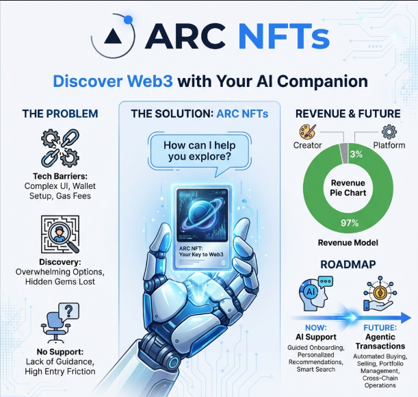

# Arc NFTs - Pitch Deck

**Slogan:** "Discover Web3 with Your AI Companion"

---

## Slide 1: Introduction

**Title:** Arc NFTs
**Subtitle:** The AI-Powered Web3 Experience.
**Visual:** Homepage showing the **Arc AI Chatbot** interface open.

---

## Slide 2: The Problem

**Title:** Web3 UX is Still Too Hard

1.  **Technical Complexity:** Terms like "Gas fee", "Contract", "RPC" scare off new users.
2.  **Discovery Issues:** Finding high-quality collections among thousands is difficult.
3.  **Lack of Support:** Users feel alone with no 7/24 guidance or support.

---

## Slide 3: The Solution (Current)

**Title:** Arc AI Chatbot (Live Beta)

*   **Conversational Guidance:** The chatbot explains complex Web3 terms in simple language.
*   **On-Demand Support:** Instant answers to platform questions, available 24/7.
*   **Smart Navigation:** Helps you find the right tools and collections.

---

## Slide 4: Revenue Model

**Title:** Sustainable & Creator-First

*   **Creators (97%):** Creators keep the lion's share of sales.
*   **Platform (3%):** Arc NFTs takes a small 3% fee to sustain the AI infrastructure.
*   **Transparent:** All fees are enforced on-chain.

---

## Slide 5: Roadmap (Future Features)

**Title:** The Evolution of Agentic Commerce

**Coming Soon (Q3-Q4 2026):**

*   **Chatbot Minting:** "Mint this for me" -> AI executes the transaction.
*   **Agentic Navigation:** AI autonomously navigates the platform for you.
*   **Auto-Transactions:** Secure, AI-managed portfolio actions.

---

## Slide 6: Technology Stack

**Title:** Built for Speed & Experience

1.  **Arc AI Chatbot:** LLM-based intelligent assistant.
2.  **Circle Programmable Wallets:** Seamless and secure wallet infrastructure.
3.  **Optimized Smart Contracts:** Low-gas, high-efficiency NFT standards.

---

## Slide 7: Team

**Title:** The Builders

*   **Atakan LAFCI:** Team Lead
*   **Dev Team:** Experienced Blockchain & AI Engineers

---

## Slide 8: Closing

**Title:** Arc NFTs

Start talking to Web3 today.

*   **Contact:** atknlfci@gmail.com
*   **Hackathon Project:** Built for Circle Hackathon

**Thank You!**
